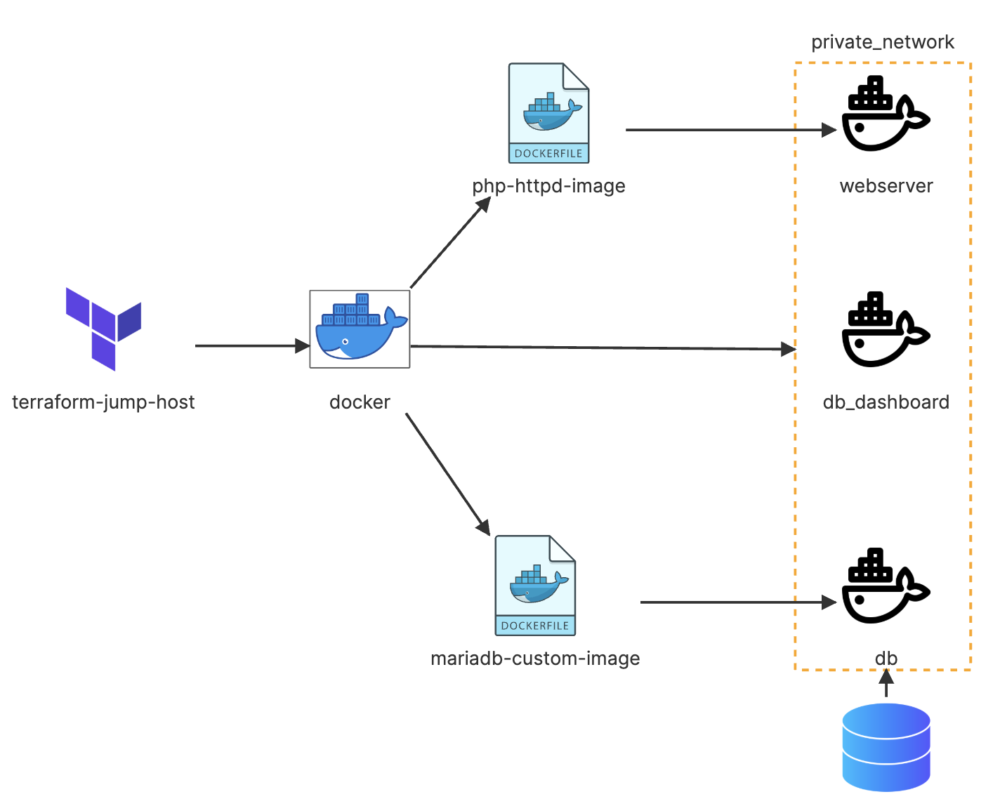

# Terraform Challenge 2

This challenge demonstrates how to deploy a LAMP stack (Linux, Apache, MySQL, PHP) using Docker containers orchestrated with Terraform. The deployment consists of a web server, database server, and phpMyAdmin for database management.

## Architecture Diagram



The diagram above illustrates the infrastructure we'll be creating:

Terraform creates Docker images and containers
A private Docker network connects all components
The webserver (Apache/PHP) container serves the website
The db (MariaDB) container stores the data with a persistent volume
The db_dashboard (phpMyAdmin) container provides database management

## Prerequisites

- Terraform (version 1.1.5)
- Docker installed and running
- Basic understanding of Docker, LAMP stack, and Terraform

## Project Structure

```
terraform-challenge-2/
├── lamp_stack/
│   ├── custom_db/           # MariaDB Docker build context
│   ├── php_httpd/           # PHP/Apache Docker build context
│   └── website_content/     # Website files to be mounted
├── mariadb-image.tf         # MariaDB Docker image resource
├── mariadb-container.tf     # MariaDB container resource
├── mariadb-volume.tf        # Docker volume for database persistence
├── php-httpd-image.tf       # PHP/Apache Docker image resource
├── php-httpd-container.tf   # PHP/Apache container resource
├── phpmyadmin.tf            # phpMyAdmin container resource
├── private-network.tf       # Docker network for container communication
└── README.md
```

## Getting Started

### 1. Clone the repository

```bash
git clone https://github.com/kmachinen/terraform-challenges.git
cd terraform-challenges/Challenge-2
```

### 2. Initialize Terraform

```bash
terraform init
```

### 3. Review the execution plan

```bash
terraform plan
```

### 4. Apply the configuration

```bash
terraform apply
```

Type "yes" when prompted to create the resources.

## Verification

After applying the Terraform configuration, verify the deployment with these commands:

### 1. Check Docker images

```bash
docker images
```

You should see the `php-httpd:challenge` and `mariadb:challenge` images.

### 2. Check Docker containers

```bash
docker ps
```

You should see three running containers:

- `webserver` (PHP/Apache)
- `db` (MariaDB)
- `db_dashboard` (phpMyAdmin)

### 3. Check Docker network

```bash
docker network ls
docker network inspect my_network
```

### 4. Check Docker volume

```bash
docker volume ls
docker volume inspect mariadb-volume
```

## Testing the Application

### 1. Web Application

Access the web application by navigating to:

```
http://localhost
```

### 2. Database Management (phpMyAdmin)

Access phpMyAdmin by navigating to:

```
http://localhost:8081
```

Login credentials:

- Username: `root`
- Password: `1234`

You should see a database named `simple-website` that was created automatically.

## Database Connection Details

When connecting to the database from PHP code in your web application:

- Host: `db` (container name)
- Username: `root`
- Password: `1234`
- Database: `simple-website`
- Port: `3306`

## Cleaning Up

To destroy all the resources created by Terraform:

```bash
terraform destroy
```

Type "yes" when prompted to destroy the resources.
